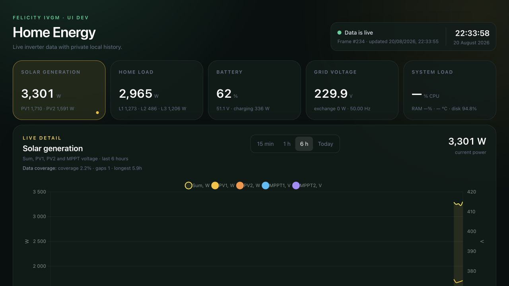
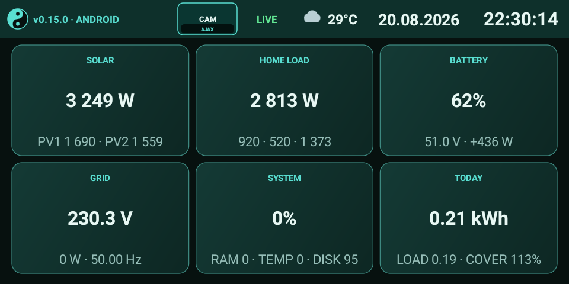
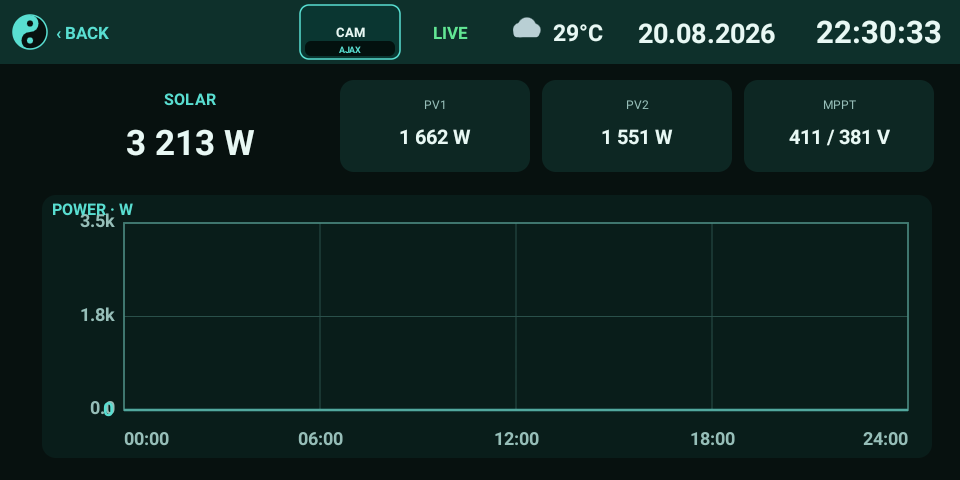

# Felicity Dashboard

[](LICENSE)
[](felicity_dashboard_addon/DOCS.md)
[](android/README.md)
[](ios/README.md)

**A private, local-first energy dashboard for Felicity IVGM hybrid inverters.**

Read the stock Wi-Fi module directly, retain compact history in SQLite, and
choose the screen that suits the room: Home Assistant, ESP32 + Nextion, or a
native Android kiosk. No cloud account is required.



## One backend, four displays

| Display | Best for | Highlights |
|---|---|---|
| **Home Assistant app** | Browser and HA sidebar | Live overview, analytics, history, diagnostics |
| **Android kiosk** | Echo Show 5 and landscape tablets | Weather, charts, Ajax doorbell video/audio, red night mode |
| **iOS (preview)** | iPad and iPhone | Native adaptive energy screen; camera and archive parity in progress |
| **ESP32 + Nextion** | Small dedicated panel | Fast local UI, Wi-Fi onboarding, dual OTA updates |

<p align="center">
  
  
</p>

The Android client is a full alternative to the original Nextion display—not
a web page in a wrapper. Ajax incoming G.722 audio is supported; outgoing
talk-back remains experimental.

## How it fits together

```text
Felicity Wi-Fi module ──TCP/53970──▶ collector ──▶ SQLite
                                                    │
                         FastAPI ◀──────────────────┘
                           ├── Home Assistant / Web
                           ├── Android kiosk
                           ├── native iOS client
                           └── ESP32 + Nextion
```

Polling is read-only. The database keeps one replaceable live snapshot plus
the fields needed for charts and energy totals; raw inverter packets are not
retained. A simulator writes the same schema, so every frontend can be tested
without an inverter.

## Quick start

```bash
python3 -m venv .venv
.venv/bin/pip install -r requirements.txt
FELICITY_HOST=192.168.1.135 .venv/bin/python collector.py
```

In another terminal:

```bash
.venv/bin/uvicorn main:app --host 0.0.0.0 --port 8000
```

Open `http://127.0.0.1:8000`. To explore safely without hardware, run
`.venv/bin/python simulator.py` instead of the collector.

## Home Assistant OS

Add this repository in **Settings → Apps → App store → ⋮ → Repositories**:

```text
https://github.com/okiyashko1337/felicity-dashboard
```

Install **Felicity Energy Dashboard**, set `inverter_host`, and start it. The
app uses Ingress, stores its database in persistent `/data`, and includes it in
Home Assistant backups.

## Choose your client

- [Home Assistant app guide](felicity_dashboard_addon/DOCS.md)
- [Android kiosk guide](android/README.md)
- [iOS client guide](ios/README.md)
- [ESP32 + Nextion guide](nextion/README.md)
- [API and backend notes](felicity_dashboard_addon/README.md)

## Security and license

The inverter protocol and compact display API have no application-level
authentication. Keep them on a trusted LAN; use a VPN or authenticated HTTPS
gateway for remote access. Ajax credentials remain in Android private storage.

Copyright 2026 okiyashko1337. Distributed under the
[non-commercial license](LICENSE); commercial use requires separate written
permission. This is source-available software, not OSI-approved open source.
